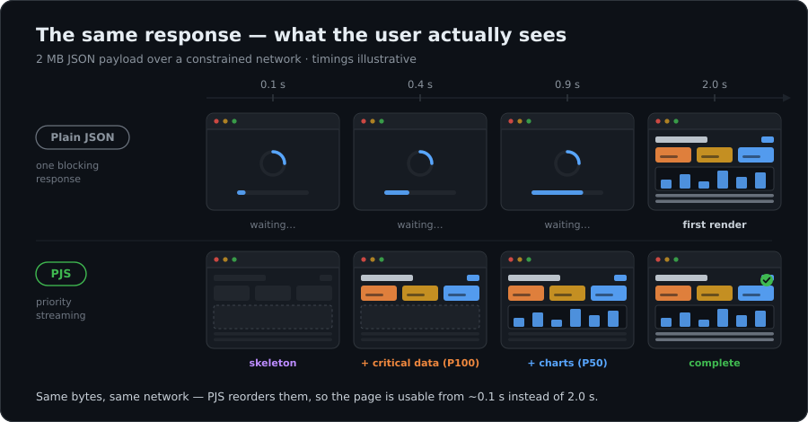
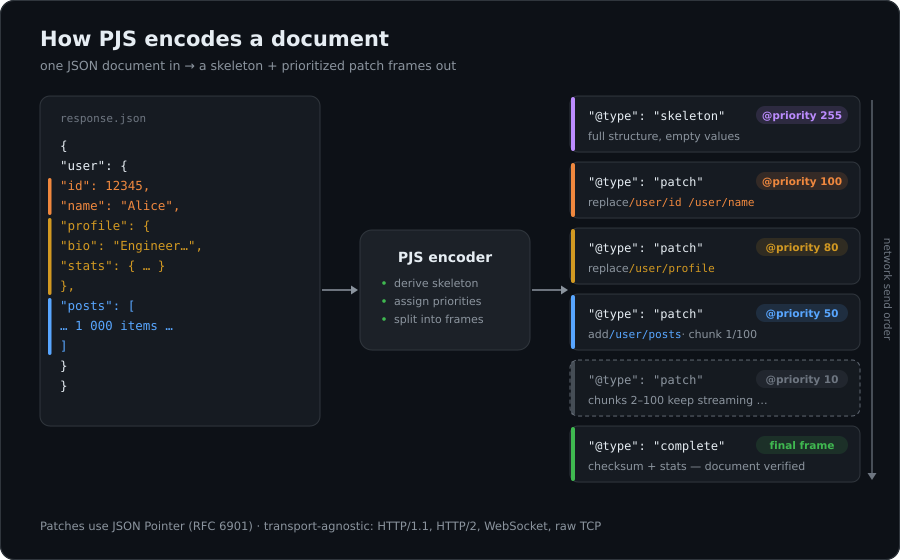
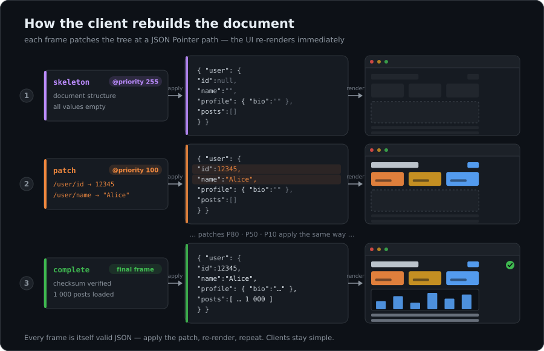
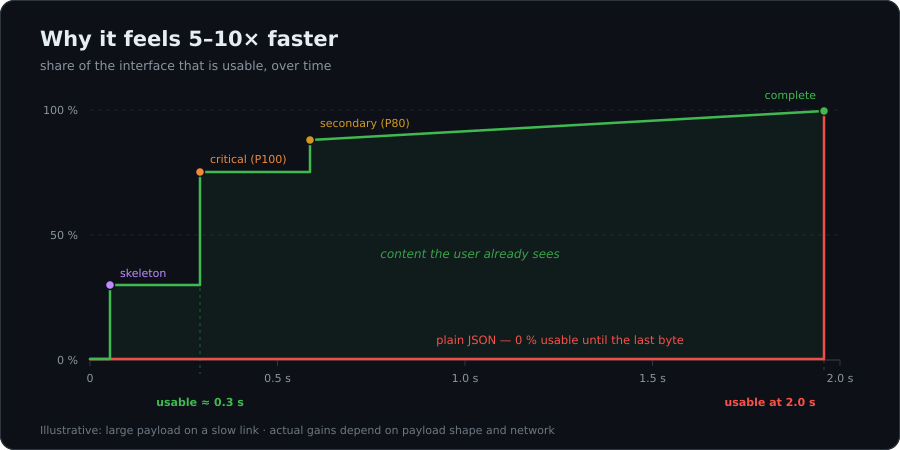

<div align="center">

# PJS — Priority JSON Streaming

**Send the JSON your UI needs first. Stream the rest.**

[](https://crates.io/crates/pjson-rs)
[](https://docs.rs/pjson-rs)
[](https://github.com/bug-ops/pjs/actions)
[](https://codecov.io/gh/bug-ops/pjs)
[](#status)
[](#license)

</div>



A large JSON response is all-or-nothing: the client renders only after the last byte arrives. PJS splits one document into a **skeleton** plus prioritized **patches**, so the UI shows meaningful content after the first frames while the heavy tail streams in the background.

It is the same breadth-first idea behind the React Server Components wire format and GraphQL's `@defer`/`@stream` — packaged as a small, framework-agnostic protocol: plain-JSON frames, [JSON Pointer](https://datatracker.ietf.org/doc/html/rfc6901) paths, any transport. Rust core, WebAssembly client (~70 KB gzipped).

## How it works

### 1 · Encode

The server derives a skeleton (full structure, empty values), assigns each subtree a priority (`0–255`), and splits the document into frames.



### 2 · Stream

Frames go out in priority order over HTTP/1.1, HTTP/2, WebSocket, or raw TCP. Every frame is plain JSON:

```json
{
  "@type": "patch",
  "@seq": 1,
  "@priority": 100,
  "@patches": [
    { "op": "replace", "path": "/user/id",   "value": 12345 },
    { "op": "replace", "path": "/user/name", "value": "Alice" }
  ]
}
```

Large arrays are chunked and streamed at low priority so they never block critical data.

### 3 · Reassemble

The client applies each patch to its local tree and re-renders immediately. Apply, render, repeat — no custom parser required on the consuming side.



## Why bother



Same bytes, same bandwidth — only the *order* changes. Layout appears with the skeleton, critical fields right after, heavy tails last. On slow links that is the difference between staring at a spinner and using the page. The protocol's design target is a 5–10× reduction in *perceived* latency for large payloads (see the [specification](docs/architecture/SPECIFICATION.md)); bytes-on-wire stay roughly the same.

## Quick start

### Rust server (Axum)

```toml
[dependencies]
pjson-rs = "0.6"
```

```rust
use pjson_rs::infrastructure::http::axum_adapter::create_pjs_router;

#[tokio::main]
async fn main() -> anyhow::Result<()> {
    let app = create_pjs_router().with_state(app_state);
    let listener = tokio::net::TcpListener::bind("127.0.0.1:3000").await?;
    axum::serve(listener, app).await?;
    Ok(())
}
```

### Browser (WebAssembly)

```bash
npm install @pjson/wasm
```

```js
import init, { PriorityStream } from '@pjson/wasm';

await init();
const stream = new PriorityStream();

stream.onFrame((frame) => {
  if (frame.priority >= 80) {
    updateUI(JSON.parse(frame.payload)); // critical data — render now
  }
});
stream.onComplete((stats) => console.log(`${stats.totalFrames} frames in ${stats.durationMs} ms`));

stream.start(json);
```

> [!TIP]
> See it side by side: `cargo run --example simple_priority_demo`, or the [browser demo](crates/pjs-wasm/demo) with transport switching and live metrics. Node.js usage and building WASM from source are covered in [`crates/pjs-wasm`](crates/pjs-wasm).

## When to use it — and when not

**Good fit**

- One endpoint returns a large document (hundreds of KB and up) and time-to-first-render matters: dashboards, feeds, catalogs, trading screens.
- Clients on slow or unstable networks — mobile first of all.
- A REST/JSON stack where adopting GraphQL or React Server Components is not on the table.

**Skip it**

- Payloads are small. Plain JSON over HTTP/2 is already fine.
- You are on RSC, or on GraphQL with `@defer`/`@stream` — you get this at the framework layer.
- The document can simply be paginated or split into separate endpoints. Do that instead.

## How it compares

|  | **PJS** | RSC wire format | GraphQL `@defer`/`@stream` | NDJSON / SSE |
|---|---|---|---|---|
| Stack | any | React | GraphQL | any |
| Transport | HTTP, WS, TCP | HTTP | HTTP multipart | HTTP |
| Unit of delivery | JSON Pointer patches | component props | fragments / list items | independent lines |
| Explicit priorities | ✅ `0–255` per subtree | implicit (`Suspense`) | per directive | — |
| Falls back to plain JSON | ✅ content negotiation | — | — | n/a |

## Performance

Two different questions, two different numbers:

- **Protocol value — time to first usable render.** This is what PJS exists for; the chart above shows the mechanism. An end-to-end TTFR benchmark (throttled network, plain JSON vs PJS) is the headline number we are building next — until it lands, treat the chart as illustrative.
- **Implementation cost — parsing and dispatch.** SIMD-accelerated parsing (`sonic-rs`, runtime dispatch to AVX-512/AVX2/SSE4.2/NEON) and GAT-based static dispatch, measured at **1.82× faster** than `async_trait` virtual calls. Reproduce: `cargo bench -p pjs-bench`.

## Security

Streaming parsers are a DoS surface, so limits are on by default: max document size and nesting depth, bounded array/object cardinality, checked arithmetic, and 4-layer decompression-bomb protection. All limits are configurable per stream.

<details>
<summary>Default limits</summary>

| Limit | Default |
|---|---|
| Max JSON size | 10 MB |
| Max nesting depth | 64 |
| Max array elements / object keys | 10 000 |
| Max RLE run | 100 000 items |
| Max delta-array size | 1 000 000 elements |
| Max decompressed size | 10 MB |

```js
const security = new SecurityConfig().setMaxJsonSize(5 * 1024 * 1024).setMaxDepth(32);
stream.setSecurityConfig(security);
```

</details>

## Feature flags

Defaults cover the common server + browser path; everything else is opt-in.

<details>
<summary>All flags</summary>

| Feature | Description | Default |
|---|---|---|
| `simd-auto` | sonic-rs SIMD backend, runtime CPU dispatch | ✅ |
| `simd-avx512` | x86_64 only; needs `-C target-cpu=native` | — |
| `schema-validation` | Schema validation engine | ✅ |
| `compression` | zlib/gzip/brotli/zstd with per-session dictionaries | ✅ |
| `partial-parse` | Streaming partial JSON parsing (`jiter`) | — |
| `http-server` / `http-client` | Axum server · reqwest client | ✅ |
| `http-auth-jwt` | JWT middleware | — |
| `websocket-server` / `websocket-client` | WebSocket transport | ✅ |
| `mimalloc` | mimalloc as global allocator | — |
| `metrics` | Prometheus endpoint | — |

> [!NOTE]
> The `jemalloc` feature was removed in v0.6.0 — switch to `mimalloc` or the system allocator.

</details>

## Status

`0.6.x` — the core protocol works end to end (Rust server, WASM browser client, Node.js), CI on Linux/macOS/Windows.

> [!IMPORTANT]
> Currently requires **nightly Rust** (zero-cost GAT async abstractions). Supporting stable is a priority on the road to `1.0` — if this blocks you, say so in [Discussions](https://github.com/bug-ops/pjs/discussions): it directly affects how we prioritize.

> [!NOTE]
> Pre-`1.0`: the [wire format](docs/architecture/SPECIFICATION.md) is a draft and may still change. Feedback on the frame format is the most valuable contribution right now.

## Architecture

Workspace crates, one line each: `pjs-domain` (pure protocol logic, WASM-compatible) · `pjs-core` (Rust implementation, HTTP/WebSocket) · `pjs-wasm` (browser/Node bindings) · `pjs-js-client` (TypeScript client) · `pjs-demo` (interactive demo servers) · `pjs-bench` (benchmarks). Details in [`docs/architecture`](docs/architecture).

## Contributing

```bash
rustup override set nightly
cargo clippy --workspace -- -D warnings
cargo nextest run --workspace --all-features
cargo +nightly fmt --check
```

See [CONTRIBUTING.md](CONTRIBUTING.md).

## License

Dual-licensed under [Apache-2.0](LICENSE-APACHE) or [MIT](LICENSE-MIT), at your option.

---

<div align="center">
<sub>PJS — priority-based JSON streaming for interfaces that refuse to wait.</sub>
</div>
